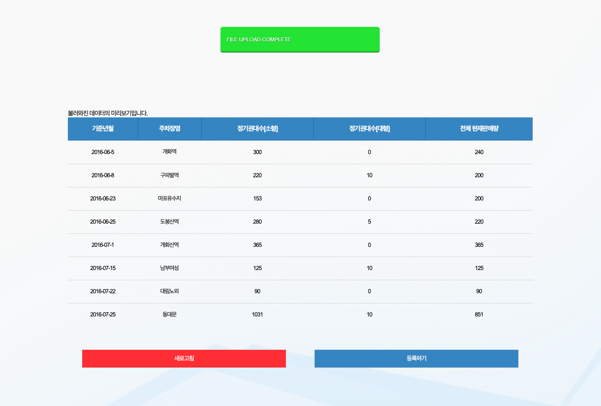
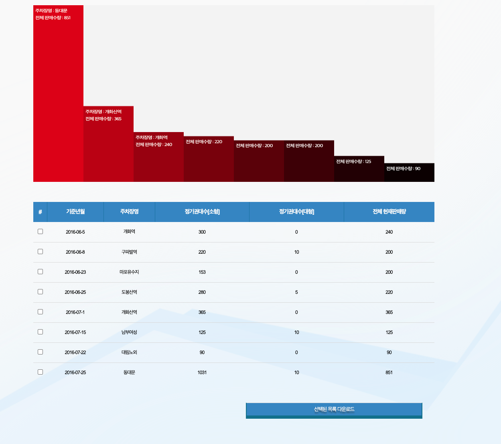

# 서울시 공영주차장 관리 소프트웨어

## 개요
서울시의 공영주차장 정보를 지정 / 관리하여 차트로 볼 수 있는 소프트웨어
## 사용방법
1. [New information] 버튼을 클릭하여 공영주차장 리스트를 등록할 수 있습니다.
2. 공영주차장 리스트는 data/list.json 파일을 업로드하면 표시됩니다.
3. 업로드 하는 순간 localStorage에 저장되며, 페이지를 새로고침해도 해당 내역을 자동으로 불러옵니다.
4. [등록하기] 버튼을 누르면 해당 차트를 기반으로 한 그래프를 볼 수 있습니다.